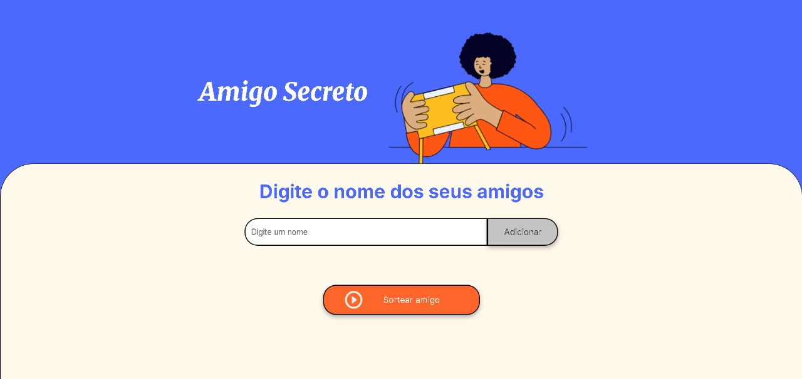

# 
 🎁 Challenge Amigo Secreto - ONE & Alura 

 

  

  
  
  
  
  

 

## Índice 
- [Capa](#-challenge-amigo-secreto---one--alura)
- [Sobre o projeto](#sobre-o-projeto)
- [Tecnologias utilizadas](#tecnologias-utilizadas)
- [Funcionalidades da aplicação](#-funcionalidades-da-aplicação)
- [Licença](#licença)

## Sobre o Projeto

Este projeto foi desenvolvido para fins educacionais, criado para resolver o **Challenge Amigo Secreto** do curso "Praticando Lógica de Programação" da **ONE (Oracle Next Education)** em parceria com a **Alura**.

A aplicação permite organizar um sorteio de amigo secreto de forma digital, onde os usuários podem adicionar nomes de participantes e realizar o sorteio de forma aleatória e divertida.

## Tecnologias utilizadas
  

## 🔨 Funcionalidades da aplicação
- Adicionar amigo à lista para sorteio
- Exibir a lista de amigos adicionados
- Sortear um amigo secreto de forma aleatória
- Exibir o resultado do sorteio
- Garantir que cada participante seja sorteado apenas uma vez por rodada
- Limpar o campo de entrada após adicionar um nome

## Licença
Este projeto foi desenvolvido para fins educacionais como parte do programa ONE (Oracle Next Education) em parceria com a Alura.